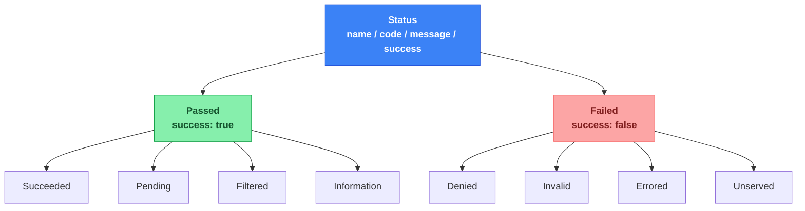

# Overview {#overview}
I'm sure you've come across a log line or an exception that just said something like "an error occurred," with no real context attached. It's frustrating, and it usually means the debugging session is about to take twice as long as it should.

Here is what I kept running into, across different jobs and different codebases.
<table class="table table-bordered table-striped">
    <tr>
        <td><strong>Problem</strong></td>
        <td><strong>Description</strong></td>
    </tr>
    <tr>
        <td><strong>Exceptions are inconsistent</strong></td>
        <td>Some get thrown for outcomes you expect, some for genuine bugs, and you usually cannot tell which just by reading a function signature.</td>
    </tr>
    <tr>
        <td><strong>Booleans tell you almost nothing</strong></td>
        <td><code>success: Boolean</code> answers one question and skips the one you actually needed.</td>
    </tr>
    <tr>
        <td><strong>HTTP codes leak everywhere</strong></td>
        <td>They show up in background jobs and CLI commands that have nothing to do with HTTP, mostly because there was nothing better around.</td>
    </tr>
</table>

None of these three things talk to each other. None of them compose. I think most of us just get used to the friction and stop noticing it, until a debugging session drags on and you realize you still don't actually know what happened, only that something didn't go as planned.

And now that so much of our code gets written, read, and debugged by AI tools, being explicit about what actually happened matters even more than it used to. More on that a bit further down.

So I built something to fix that for myself. It's called kiit.codes, and this post is about what it is, why it looks the way it does, and where it's going next.
{}

# What is kiit.codes {#what-is-kiit-codes}
At its simplest, kiit.codes gives every operation in your code a `Status`. Not an exception, not a raw boolean, a real structured value with a name, a code, a message, and a flag telling you whether it succeeded.

It works the same way whether you are inside a service call, a background job step, an API handler, or a CLI command. That is the whole point, honestly. One shape, everywhere.

Here is what a `Status` looks like once it leaves your code, say, as part of an API error body.

```json

    {
        "name"   : "TOKEN_EXPIRED",
        "type"   : "Denied",
        "code"   : 400009,
        "success": false,
        "message": "Session token expired"
    }

```

Nothing fancy. Just enough structure that a human reading it instantly understands what happened, and enough consistency that a machine parsing thousands of these can group and count them without guessing.

One thing worth saying early, a `Status` describes the kind of outcome, not the specific value behind it. It won't hand you the exact id that wasn't found or the field that failed validation, that detail lives one layer up, and I'll get to where later in this post.

It's a small library too, dependency free, and you can pull it into a project on its own without buying into the rest of the Kiit framework. The full source lives at <strong><a class="url-ch" href="https://github.com/slatekit/kiit-codes">github.com/slatekit/kiit-codes</a></strong>, if you want to poke around before reading any further.
{}

# Inspired by HTTP and gRPC {#inspired-by-http-and-grpc}
I did not invent this idea. It's basically HTTP status codes and gRPC status codes, generalized to work outside the boundaries of an HTTP request or an RPC call.

HTTP groups its codes into families, 2xx, 4xx, 5xx, and pairs each specific code with a name, like `404 Not Found`. gRPC does something similar but flatter, seventeen named codes, each carrying a small integer alongside it, `PERMISSION_DENIED` next to the number 7, that sort of thing.

```kotlin

    // The same idea, three different worlds
    Codes.DENIED               // kiit.codes
    401 Unauthorized           // HTTP
    PERMISSION_DENIED          // gRPC

```

What I added on top is a middle layer, a small set of fixed categories sitting between "did it work" and "here is the exact code." HTTP does not really have that, and neither does gRPC. It turned out to matter more than I expected.
{}

# Design principles {#design-principles}
kiit.codes was built around a small set of principles, and I think most of the rest of the library falls out of these naturally.
<table class="table table-bordered table-striped">
    <tr>
        <td><strong>Principle</strong></td>
        <td><strong>Description</strong></td>
    </tr>
    <tr>
        <td><strong>Universal</strong></td>
        <td>Works the same way in service layers, background jobs, and route handlers, <code>UserService.kt</code> does not need to think about status any differently than a queue worker does.</td>
    </tr>
    <tr>
        <td><strong>Hierarchy</strong></td>
        <td>Every status belongs to a logical group, successes and failures each have their own small set of categories underneath them.</td>
    </tr>
    <tr>
        <td><strong>Standard</strong></td>
        <td>One precise status type and representation, used the same way across every layer of your code.</td>
    </tr>
    <tr>
        <td><strong>Compliant</strong></td>
        <td>Convertible to HTTP status codes through <code>CodesToHttp().toCode(status)</code>, whenever you actually need a real HTTP response.</td>
    </tr>
    <tr>
        <td><strong>Reusable</strong></td>
        <td>A status like <code>Codes.SUCCESS</code> is just one instance, reused across every operation that yields the same outcome.</td>
    </tr>
    <tr>
        <td><strong>Extensible</strong></td>
        <td>Add new codes for your own domain or feature by constructing a new <code>Passed</code> or <code>Failed</code> subtype, no need to touch the library itself.</td>
    </tr>
    <tr>
        <td><strong>Searchable</strong></td>
        <td>The name and the category are both unique and easy to search for in logs.</td>
    </tr>
    <tr>
        <td><strong>Aggregated</strong></td>
        <td>Because of the hierarchy, you can group and count by type or by name across your logs and metrics.</td>
    </tr>
    <tr>
        <td><strong>Exceptions</strong></td>
        <td>Still compatible with exceptions, <code>StatusException</code> is a subtype of <code>Exception</code> that carries the status across a boundary.</td>
    </tr>
</table>

Worth flagging, that reusable point has a limit to it. The next section covers it directly.
{}

# What this doesn't do {#what-this-doesnt-do}
Worth being explicit about this, rather than leaving it scattered across a few asides.
<table class="table table-bordered table-striped">
    <tr>
        <td><strong>#</strong></td>
        <td><strong>Limitation</strong></td>
        <td><strong>Description</strong></td>
    </tr>
    <tr>
        <td><strong>1</strong></td>
        <td><strong>Error detail values</strong></td>
        <td>A <code>Status</code> won't hold the actual value behind a failure, the id that wasn't found, the field that failed validation, none of that. It describes the kind of outcome, not the specific instance of it. That detail belongs one layer up.</td>
    </tr>
    <tr>
        <td><strong>2</strong></td>
        <td><strong><code>Result&lt;T, E&gt;</code> usage</strong></td>
        <td>This library gives you the <code>Status</code> type itself, nothing more. It doesn't wrap a value and an error together the way a <code>Result</code> type does. That's a separate component, built on top of this one, not part of it.</td>
    </tr>
</table>

Both of these are handled by kiit results, which I'll get to near the end of this post.
{}

# Three tiers of detail {#three-tiers-of-detail}
There are really three questions you might want answered about any operation.
<table class="table table-bordered table-striped">
    <tr>
        <td><strong>#</strong></td>
        <td><strong>Question</strong></td>
        <td><strong>Description</strong></td>
    </tr>
    <tr>
        <td><strong>1</strong></td>
        <td><strong>Did it work at all</strong></td>
        <td>Just yes or no.</td>
    </tr>
    <tr>
        <td><strong>2</strong></td>
        <td><strong>What kind of outcome was it, broadly speaking</strong></td>
        <td>A permissions problem? Bad input? Something the system just could not handle right now?</td>
    </tr>
    <tr>
        <td><strong>3</strong></td>
        <td><strong>What exactly happened</strong></td>
        <td>The specific, named thing, useful for logs, metrics, and debugging.</td>
    </tr>
</table>

kiit.codes answers all three, and the first two are enforced by the compiler, not just convention.



Let's look at each tier on its own.

**Tier one, pass or fail.**

```kotlin

    when (status) {
        is Passed -> log.info("operation succeeded")
        is Failed -> log.warn("operation failed")
    }

```

**Tier two, the eight categories.**

```kotlin

    when (val status = createUser(email)) {
        is Passed.Succeeded    -> log.info("created: ${status.name}")
        is Passed.Pending      -> log.info("queued: ${status.name}")
        is Passed.Filtered     -> log.info("skipped: ${status.name}")
        is Passed.Information  -> log.info("info: ${status.name}")
        is Failed.Denied       -> log.warn("denied: ${status.message}")
        is Failed.Invalid      -> log.warn("invalid: ${status.message}")
        is Failed.Errored      -> log.warn("errored: ${status.message}")
        is Failed.Unserved     -> log.warn("unserved: ${status.message}")
    }

```

Miss a branch in either of these two and the compiler tells you. No silent fallthrough, no forgotten case hiding in an `else`.

**Tier three, the specific code.**

```kotlin

    when (status) {
        Codes.TIMEOUT, Codes.RATE_LIMITED -> retryWithBackoff()
        else                              -> reportAndFail(status)
    }

```

Notice the `else` here. Codes are meant to be open, you can add as many as you want for your own domain, so there is no way, or really no reason, to make this level exhaustive. Only the first two tiers are locked down. The third stays flexible on purpose.

```kotlin

    val PAYMENT_DECLINED = Failed.Errored("PAYMENT_DECLINED", 700123, "Payment declined")

```

That still slots neatly into the taxonomy. It is still a `Failed.Errored`. It still shows up correctly wherever the library expects a `Status`.

Put all three tiers together and it looks something like this, a single function that zooms in a little further at each step.

```kotlin

    fun handleOutcome(status: Status) {
        // tier one, pass or fail
        when (status) {
            is Passed -> log.info("succeeded")
            is Failed -> log.warn("failed")
        }

        // tier two, the category
        when (status) {
            is Passed.Succeeded    -> onCreated(status)
            is Passed.Pending      -> onQueued(status)
            is Passed.Filtered     -> onSkipped(status)
            is Passed.Information  -> onInfo(status)
            is Failed.Denied       -> onDenied(status)
            is Failed.Invalid      -> onInvalid(status)
            is Failed.Errored      -> onErrored(status)
            is Failed.Unserved     -> onUnserved(status)
        }

        // tier three, the specific code
        when (status) {
            Codes.TIMEOUT, Codes.RATE_LIMITED -> retryWithBackoff()
            else                              -> Unit
        }
    }

```

You wouldn't usually write all three checks back to back like this in real code, but it's a decent way to see the whole idea at once. Zoom out for a quick log line, zoom in for the branch you actually need to handle, zoom in again when a couple of specific codes deserve special treatment.
{}

# Use case 1: Validation {#use-case-1-validation}
A boolean is tempting, one bit, done, ship it.

```kotlin

    // what you had
    fun createUser(email: String): Boolean

    // what you actually needed to know
    fun createUser(email: String): Status

    // Status is also part of the kiit-results type, for another post.
    fun createUser(email: String): Result<Boolean, Err>

```

The boolean tells you it failed. It does not tell you the email was blank, or that the address was already taken, or that a downstream service was down. You end up bolting on a second return value, or throwing an exception just to smuggle in the reason, and now you are back to square one.

The same pattern works well for validation, which is honestly where I use it most.

```kotlin

    fun validateEmail(email: String): Status {
        if (email.isBlank())        return Codes.BAD_REQUEST
        if (!email.contains("@"))   return Codes.INVALID
        return Codes.SUCCESS
    }

    // Status is also part of the kiit-results type, for another post.
    fun validateEmail(email: String): Result<Boolean, Err>

```

Every caller of this function gets the exact same shape back, whether it succeeded or failed, and whether this is the tenth validation function in the codebase or the hundredth.
{}

# Use case 2: Exceptions {#use-case-2-exceptions}
I want to be clear about this because I think it is easy to misread the whole idea as "stop using exceptions." That is not it at all.

Sometimes you are stuck. A framework catches `Exception`, or a boundary you do not control only speaks in throws and catches. For those moments there is `StatusException`, which just wraps a `Status` so you do not lose any of the structure when you are forced to throw.

```kotlin

    throw StatusException(Codes.UNAUTHORIZED)

    try {
        // ...
    } catch (e: StatusException) {
        when (e.status) {
            is Failed.Denied    -> // handle auth failure
            is Failed.Invalid   -> // handle bad input
            is Failed.Errored   -> // handle known business rule failure
            is Failed.Unserved  -> // handle capacity, timeout, or something not implemented yet
            is Passed           -> // shouldn't really happen, Passed statuses aren't normally thrown
        }
    }

```

So the rule I try to follow is simple. Return a `Status` wherever you reasonably can. Reach for `StatusException` only at the boundaries where you have no other choice. You keep the structure either way, which is really the whole point.
{}

# Use case 3: API responses {#use-case-3-api-responses}
Say a route handler returns a `Status` instead of throwing.

```kotlin

    fun getUser(id: String): Status {
        val user = repository.find(id)
        return user?.let { Codes.SUCCESS } ?: Codes.NOT_FOUND
    }

    // Status is also part of the kiit-results type, for another post.
    fun getUser(id: String): Result<User, Err>

```

Then, right before you write the actual HTTP response, you convert. A small utility function keeps this in one place instead of repeating it at every route.

```kotlin

    // works the same whether you're wiring it into Ktor, Spring, or anything else
    fun toApiResponse(status: Status): Pair<Int, Map<String, Any>> {
        val httpCode = CodesToHttp().toCode(status)
        val body = mapOf(
            "name" to status.name,
            "code" to status.code,
            "message" to status.message,
            "success" to status.success,
        )
        return httpCode to body
    }

    val (httpCode, body) = toApiResponse(getUser(id))

```

Every endpoint in your API ends up with the exact same error shape, whether it's a 404, a 401, or a 500, and the mapping from status to HTTP code lives in exactly one place.
{}

# Readable by AI too {#readable-by-ai-too}
This part might be my favorite piece of the whole design, and it is something I did not fully appreciate until I started working alongside AI coding tools day to day.

I think there is a broader point hiding here too. Now that so much of our code gets read, debugged, and even written by AI, being explicit about exactly what happened matters more than it used to, not less. A vague message that a human could still puzzle through from context is a much worse starting point for a model that has no memory of yesterday's incident and no hallway conversation to lean on. If anything, the case for structure over prose only gets stronger from here.

When an AI assistant is helping debug something, it usually needs to find every place a particular failure gets thrown, handled, tested, and logged. A free text message like "payment provider timed out after three attempts" is a bad search target. The wording drifts between call sites, gets mixed with runtime data, and two similar failures can end up looking nearly identical in a log even when they are not the same thing at all.

A stable name does not have that problem.

```bash

    grep -r "Codes.TIMEOUT"

```

That one line finds every throw site, every handler, every test, with zero ambiguity. No interpretation needed, no guessing whether this occurrence of "timeout" means the same thing as that one three files over.

The closed set of categories helps too, in a slightly different way. An AI encountering `Failed.Unserved` somewhere in an unfamiliar codebase does not need to reconstruct meaning from context each time. Learn what the category means once, and that understanding carries across every file, every service, every place it shows up. A free form exception hierarchy does not give you that, every subclass kind of has to be relearned on its own.

I will admit, this is a triage layer, not a replacement for good logs or a real root cause. But it gives an AI, or honestly a tired developer, a fast first branch to reason from before falling back to anything unstructured. And that, I think, is worth quite a lot.
{}

# What's next {#whats-next}
As covered earlier, `Status` deliberately doesn't hold onto the specific value behind a failure. That gap is exactly what kiit results was built to close, and it's really where kiit.codes was headed all along.

It is a `Result<T, E>` type, similar in spirit to Rust's `Result`, Swift's `Result`, or the `Either` type from Scala. But there is a twist. The `Success` and `Failure` branches are constrained, at the type level, to only ever hold a `Passed` or `Failed` status respectively.

```kotlin

    sealed class Result<out T, out E> {
        data class Success<out T>(val value: T, val status: Passed = Codes.SUCCESS) : Result<T, Nothing>()
        data class Failure<out E>(val error: E, val status: Failed = Codes.ERRORED) : Result<Nothing, E>()
    }

```

That means it is not just difficult to accidentally put a failing status on a success, it is actually impossible. The compiler will not let you construct a `Success` holding `Failed.Denied`. No runtime check required, no test needed to catch that mistake, it simply cannot happen.

I think that is a genuinely different guarantee than what Rust or Swift's `Result` types give you out of the box, and it only works because of everything kiit.codes already enforces underneath it.
{}

# Try it {#try-it}
If any of this sounds useful, it is easy to pull in on its own.

```kotlin

    dependencies {
        implementation("dev.kiit:kiit-codes:0.1.2")
    }

```

A few places to go from here.
<table class="table table-bordered table-striped">
    <tr>
        <td><strong>Resource</strong></td>
        <td><strong>Link</strong></td>
    </tr>
    <tr>
        <td><strong>Source code</strong></td>
        <td><a class="url-ch" href="https://github.com/slatekit/kiit-codes">github.com/slatekit/kiit-codes</a></td>
    </tr>
    <tr>
        <td><strong>Maven Central</strong></td>
        <td><a class="url-ch" href="https://central.sonatype.com/artifact/dev.kiit/kiit-codes">dev.kiit:kiit-codes</a></td>
    </tr>
    <tr>
        <td><strong>A runnable example</strong></td>
        <td><a class="url-ch" href="https://github.com/slatekit/kiit-codes/blob/main/samples/sample1">samples/sample1</a></td>
    </tr>
    <tr>
        <td><strong>The wider Kiit framework</strong></td>
        <td><a class="url-ch" href="https://www.kiit.dev">kiit.dev</a></td>
    </tr>
    <tr>
        <td><strong>Docs</strong></td>
        <td><a class="url-ch" href="https://www.kiit.dev/codes">kiit.dev/codes</a></td>
    </tr>
</table>

And if you try it and something feels off, or you think a category is missing, or you just have thoughts, I would honestly love to hear them. Open an issue on <strong><a class="url-ch" href="https://github.com/slatekit/kiit-codes/issues">GitHub</a></strong>, I read every one.
{}

<script>
    var archComponent = {
        name: "kiit.codes",
        page: "blog/kiit-codes",
        icon: "assets/media/img/white/notes.png",
        menu: {
            mode: "normal",
            useTemplate: false,
            sections: [
                {
                    name: "About",
                    items: [
                        { name:"Overview",     anchor: "#overview" },
                        { name:"kiit.codes",   anchor: "#what-is-kiit-codes" },
                        { name:"Inspiration",  anchor: "#inspired-by-http-and-grpc" }
                    ]
                },
                {
                    name: "Design",
                    items: [
                        { name:"Principles",          anchor: "#design-principles" },
                        { name:"Out of scope",        anchor: "#what-this-doesnt-do" },
                        { name:"3 Tiers of Detail",   anchor: "#three-tiers-of-detail" }
                    ]
                },
                {
                    name: "Examples",
                    items: [
                        { name:"Use case 1",  anchor: "#use-case-1-validation" },
                        { name:"Use case 2",  anchor: "#use-case-2-exceptions" },
                        { name:"Use case 3",  anchor: "#use-case-3-api-responses" }
                    ]
                },
                {
                    name: "Usage",
                    items: [
                        { name:"Readable by AI",  anchor: "#readable-by-ai-too" },
                        { name:"What's next",     anchor: "#whats-next" },
                        { name:"Try it",          anchor: "#try-it" }
                    ]
                }
            ]
        }
    };

    function setupArchComponent() {
        buildArchComponent(archComponent);
    }
</script>
